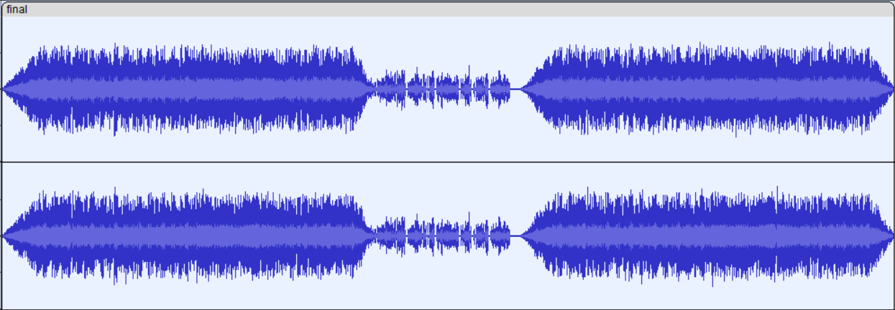
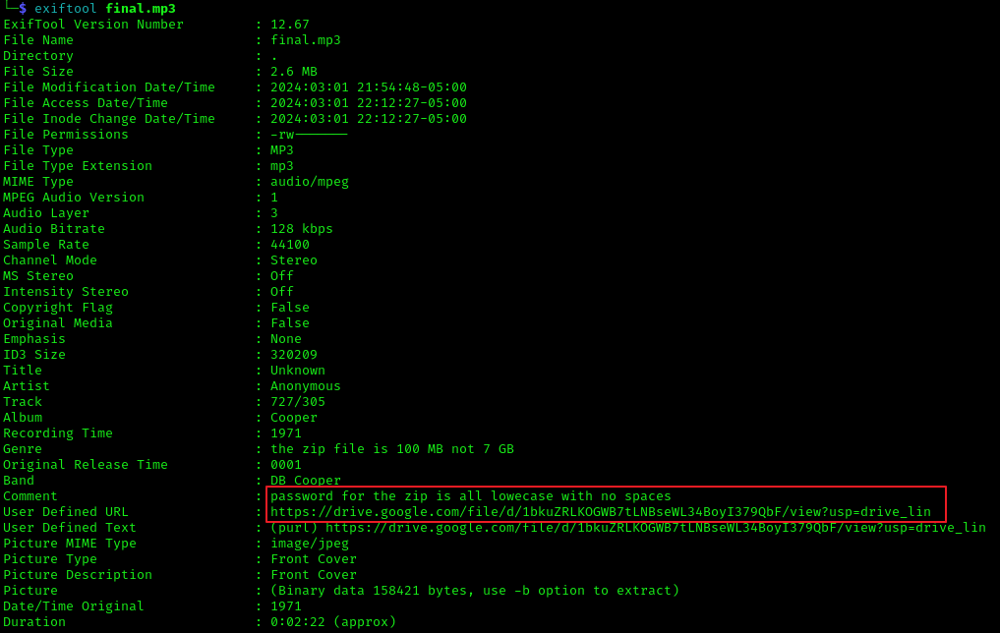

# Mysterious Old Case

# Problem

You as a FBI Agent, are working on a old case involving a ransom of $200,000. After some digging you recovered an audio recording.

Author : Abhishek Mallav

FLAG FORMAT:
VishwaCTF{}

Files Provided:
- [final.mp3](Files/final.mp3)

# Solution
Listening to the file provided to us, it was mostly just some sort of music, but somewhere mid-way we can hear some gibberish as can be seen below. Using audacity we can analyze it further.



We can extract the gibberish part towards the middle and analyze it.

https://github.com/Firerey12/VishwaCTF_2024_Write_Ups/assets/105744465/e27cced7-410d-4690-978d-f6d853d337e8


But listening to it we can see that it seems that the audio has been reversed. We can use Audacity to Reverse it again to recover the original audio, which gives us a clue.

https://github.com/Firerey12/VishwaCTF_2024_Write_Ups/assets/105744465/5d94ba71-dc59-4abb-b3e8-ba70374afc16

> I am Dan Cooper, it is 24th November, 1971. Now I have left from Seattle and headed towards Reno. I have got all my demands fulfilled. I have done some changes in the flight log and uploaded it to a remote server. The file is ecrypted. The hint for description is the airliner that I was flying in. Most importantly, the secret key is split and hidden in every element of the fibonacci series, starting from two ~ _Some Guy in a CTF challenge_.

After listening to the clue, we get some key information such as the name Dan Cooper who was a person who hijacked a Northwest Orient Airlines flight on November 24, 1971, and that there is a password which is the airliner that was hijacked.

So now that we have that information, we can take a more closer look at the resources we have. We can try looking at the metadata for the mp3 file we have.



We can see there is a google drive link there (https://drive.google.com/file/d/1bkuZRLKOGWB7tLNBseWL34BoyI379QbF/view?usp=drive_lin) which leads us to a zip file called flight_logs.


Upon trying to extract the zip file, we are prompted for a password. Looking at the clue we got it says the password is the airliner Dan Cooper was flying in. So looking at the [Wikipedia](https://en.wikipedia.org/wiki/D._B._Cooper) page we can find the Airliner that he was flying was a "Boeing 727." Turns out that wasn't the password, so I thought they meant airline instead of airliner, since the audio wasn't much clear. So I tried "northwestorientairlines" which finally worked.

So now we need to find the flag in the files. Looking at the files in the folder we can see there are two different types of files a regular file and a text document file. So I decided to filter it based on file type, and looked at those files. Looking at the second file (I guess the clue about the Fibonacci sequence starting from 2 meant the 2nd file), we can see the flag, although a bit spaced out. 

[Flight-305.log](Solution/Flight-305.log) (snippet truncated since it was too long):

```

1971-11-24 06:22:08.531691 - ATT - Boeing 727
V
i
1971-11-24 07:31:08.531691 - HWR - Boeing 727
s
1971-11-24 06:22:08.531691 - ATT - Boeing 727
1971-11-24 07:31:08.531691 - HWR - Boeing 727
h
1971-11-24 06:22:08.531691 - ATT - Boeing 727
1971-11-24 06:22:08.531691 - ATT - Boeing 727
1971-11-24 06:22:08.531691 - ATT - Boeing 727
1971-11-24 07:31:08.531691 - HWR - Boeing 727
w
1971-11-24 07:31:08.531691 - HWR - Boeing 727
1971-11-24 06:22:08.531691 - ATT - Boeing 727
1971-11-24 06:22:08.531691 - ATT - Boeing 727
1971-11-24 07:31:08.531691 - HWR - Boeing 727
1971-11-24 07:31:08.531691 - HWR - Boeing 727
1971-11-24 07:31:08.531691 - HWR - Boeing 727
1971-11-24 06:22:08.531691 - ATT - Boeing 727
a
.
.
.
.

```

At this point we pretty much have the flag, and since I was too lazy to grab each letter one by one I wrote a Python script to grab the flag for me.

[getflag.py](Solution/getflag.py):

```python

with open("flag.txt", "w") as flag:
    with open("flight_logs/flight_logs/Flight-305.log") as f:
        for line in f:
            buffer = line.strip()
            if len(buffer) == 1:
                flag.write(buffer)

```

The script basically checks the length of the line read and writes it to the flag.txt file if the length is equal to 1, which finally gives us the Final Flag.

## Flag
VishwaCTF{1_W!LL_3E_B@CK}
