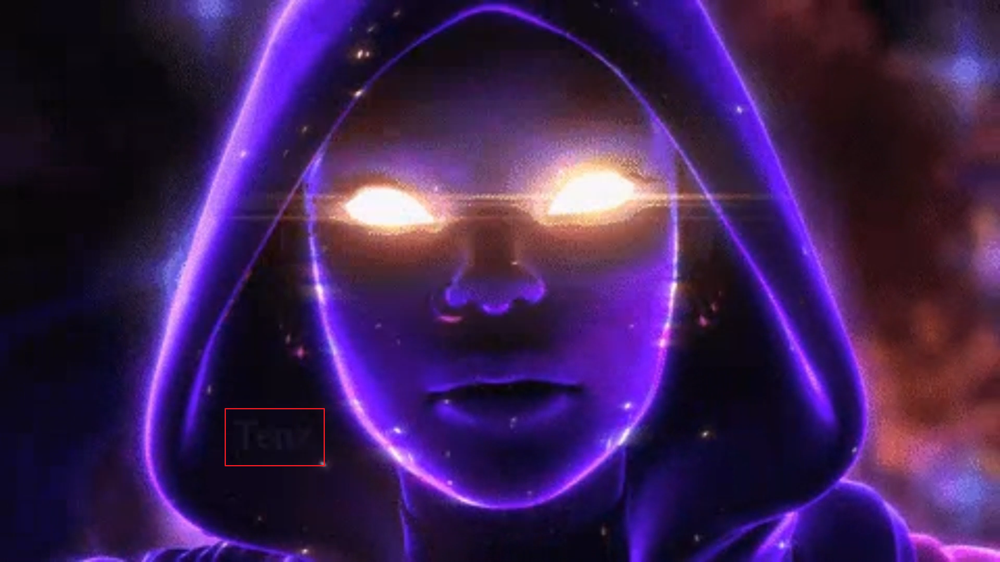
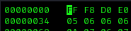
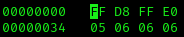
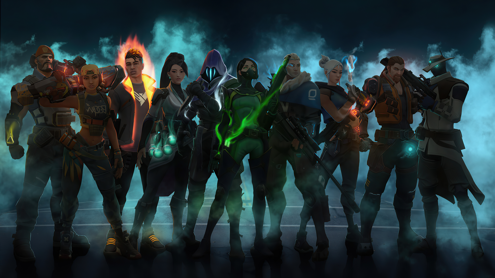
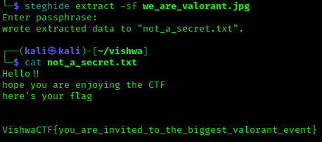

# We are Valorant

# Problem
One day, while playing Valorant, I received a mail from Riot Games that read,

“In a world full of light, sometimes the shadows help you win.” “Your Signature move also helps you a lot ; develop one and ace it now.”

It also had an image and a video/gif attached to it. I am not able to understand what they want to say. Help me find what the message wants to express.

Author : Abhinav Mehta

FLAG FORMAT:
VishwaCTF{}

Files Provided:
- [Astra_!!.mp4](Files/Astra_!!.mp4)
- [we_are_valorant.jpg](Files/we_are_valorant.jpg)

# Solution
Looking at the files we are given, the we_are_valorant.jpg seems to be corrupted, but the Astra_!!.mp4 does play. Initially looking at the mp4 file it doesn't really look like much, but after looking at it a few times, I noticed a slght flicker around the end of the file, so I looked at it Frame by Frame and got a word written saying "Tenz"

Now to figure out where to use this newly found clue. Only thing we had was a corrupted image. I tried to look into the hexdump to see if maybe the Magic Numbers were not intact since that usually is the case with the Easy level Steganography challenges. Turns out that hunch paned out and I corrected the Magic Numbers to that of a jpg file using hexedit.

 

That finally gives us an image back

The image doesn't really have anything much on it, it was just a regular image of some Valorant agents. Then I remembered we have a key ("Tenz"). So I tried to use steghide using "Tenz" as the password to extract any secret if any from the image. Turns out that was it, using that password, steghide gives us a file called not_a_secret.txt which gives us our final Flag.

## Flag
VishwaCTF{you_are_invited_to_the_biggest_valorant_event}
