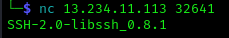
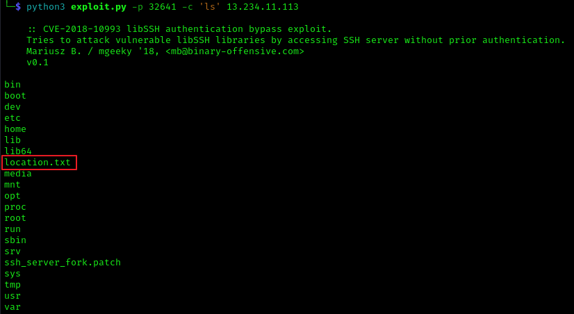
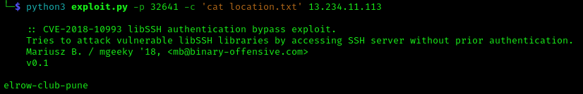

# Save the City

# Problem
The RAW Has Got An Input That ISIS Has Planted a Bomb Somewhere In The Pune! Fortunetly, RAW Has Infiltratrated The Internet Activity of One Suspect And They Found This Link. You Have To Find The Location ASAP!

Aurthor : Samarth Ghante & Harshali Patil

FLAG FORMAT:
VishwaCTF{}

Provided Information:
> nc 13.234.11.113 32641

# Solution
This was an Easy difficulty Web challenge which involved exploiting a vulnerable libSSH. 

Netcatting to the provided IP and Port provided us with plenty of information to solve this.

This gives us the version of libSSH being used. Googling this gives us a bunch of exploits we can run. I went with mgeeky's [code]([url](https://gist.github.com/mgeeky/a7271536b1d815acfb8060fd8b65bd5d#file-cve-2018-10993-py))
The code was pretty long so I decided not to put it here, but you should check it out at the link provided.

But basically running the code tells us how to use it.

This tells us how to use the program. So all we have to do is give it the IP and port and give it a command to run. I decided to run `ls` to see what files were in the directory.

We can see a file named `location.txt` which is likely the flag.

Running the code again this time with `cat location.txt` as the command we get the Final Flag.

## Flag
VishwaCTF{elrow-club-pune}
