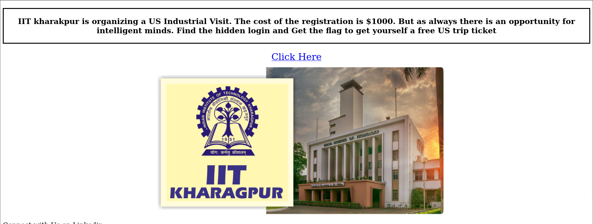
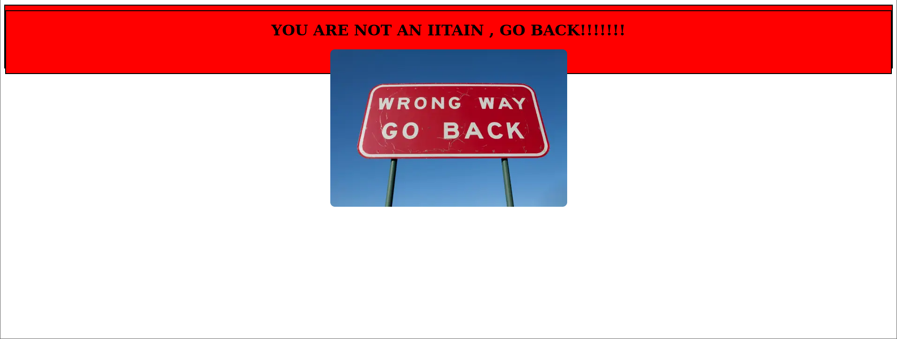
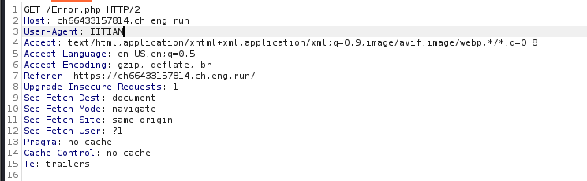

# Trip to US

# Problem
IIT kharakpur is organizing a US Industrial Visit. The cost of the registration is $1000. But as always there is an opportunity for intelligent minds. Find the hidden login and Get the flag to get yourself a free US trip ticket.

Author : Samarth Ghante & Kanishk Kumar

FLAG FORMAT:
VishwaCTF{}

Information Provided:
> https://ch66433157814.ch.eng.run

# Solution
Initially entering the website we are greeted with a simple looking homepage, with a message stating to find the hidden login page.



Looking at the source code there wasn't much there to see, so I decided to click the link which said 'Click Here.' Which took me to a page which looked like I did not have access to with my current credentials.



I decided once again to look at the source code, and found out what to do.

[Error.php](Files/Error.php)

```html

<!DOCTYPE html>
<html lang="en">
<head>
    <meta charset="UTF-8">
    <meta name="viewport" content="width=device-width, initial-scale=1.0">
    <title>HomePage</title>
    <style>
        .container {
            text-align: center;
            border: 2px solid black;
            margin-top: 10px;
            background-color: red;
            height: 100pt;

        }
        img{
            border-radius: 10px;
        }
    </style>
</head>
<body>
    <div class="container">
    
                    <div class="container">
            <h1>YOU ARE NOT AN IITAIN , GO BACK!!!!!!!</h1>
            
            </div>       
                </div>
</body>
</html>

```

If we look at the img tag towards the end of the webpage, we can see that the alt attribute says to change User agent to 'IITIAN.' I proceeded to do that using Burpsuite, which then gave access to the aforementioned hidden login page

HTTP Request modification using Burpsuite:



Login Page:


Then considering, we were given what to do in the previous page, I decided to look at the source code again, and sure enough we got some instructions again.

[auth-iit-user.php](Files/auth-iit-user.php):

```html

<!DOCTYPE html>
<html>
<head>
	<title>LOGIN</title>
	<link rel="stylesheet" type="text/css" href="style.css">
	<style>
img{
    width: 100%;
    position: absolute;
    z-index: -1;
}
    </style>
</head>
<body>
	
	<h1>Welcome to IIT Kharakpur, US trip form</h1>
    <p style="font-size:20px;"><strong>Login to get your registration ID</strong></p>
    <form action="user-validation.php" method="post">
     	<h2>LOGIN</h2>
     	     	<label>User Name</label>
     	<input type="text" name="uname" placeholder="User Name"><br>

     	<label>User Name</label>
     	<input type="password" name="password" placeholder="Password"><br>

     	<button type="submit">Login</button>
    </form>
</body>
</html>

```

Again looking at the first img tag, we can see the alt attribute says to 'USE username as: admin.' Furthermore, the USE is in all caps indicating that we might need to use SQL Injection.
So I tried that with the most basic SQL Injection (' or 1=1;--), but that gave me a Query Error. So I assumed they must be filtering out something. Thereafter I tried a similar Injection by just changing the
comment from '--' to '#', which finally worked and sent us to the flag page.


## Flag
VishwaCTF{y0u_g0t_th3_7r1p_t0_u5}

